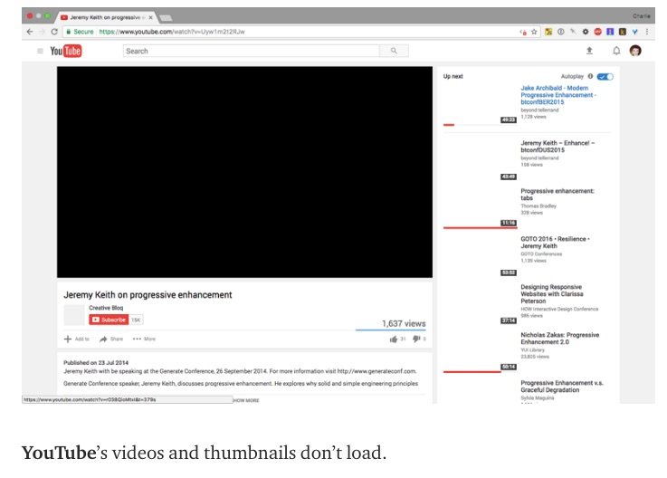
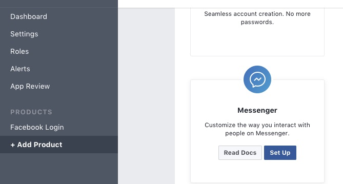
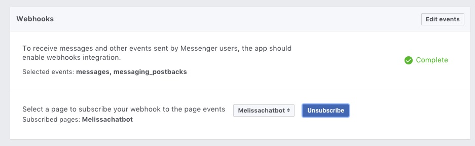

# Build A Bot Workshop

In this workshop we'll build a Facebook chatbot in 5 easy steps. Along the way we'll learn the basics of building an application, the Javascript programming language, and Node.js which is a way to use Javascript to build applications.

## Step 1: Create your app

### What is an app?
App is short for application, it's just a computer program that can perform functions, activities, or tasks. Every application needs a home, and since our application needs to talk to Facebook, which lives on the internet, it will need to live on the internet too. A home that allows an application to talk to the internet is called a "server." In the olden days, a server was a physical object, but nowadays they often are "virtual" which means hundreds or thousands of virtual servers are in one giant physical server. So it's more like a condo than a house.

A great place for an app to live is Glitch, which uses containers to further subdivided a virtual server-  it's more like having a room in a shared apartment. You share the kitchen, which is like the operating system, but have your own bedroom which is like your own application. It's free and more importantly it's easy and you can edit the application as long as you connected to the internet. Also Glitch has a lot of basic apps you can just copy by "remixing them."

### What is Javascript?
Our app will be built using Javascript. Javascript is probably the most famous of all computer languages. A computer language is simply a way for us to tell computers what to do. Javascript is critical to the internet because it's the language your browser understands. HTML and CSS are the structure and appearance, but JS makes the web interactive. Want to play a video? See the latest FB updates automatically without refreshing your browser? Chat with your friends? Play a game on the web? [JS makes that possible.](https://medium.freecodecamp.org/what-the-web-looks-like-without-javascript-c7eaf09c9983) 

But JS can also be used for so much more. 

### What is Node.js?
Our application won't interact directly with the browser at all. It will interact with Facebook, which has something called an API. API stands for Application programming interface, here it's just a set of things we can tell FB messenger to do. This collection of instructions will make up our Bot. 

### What are Chatbots?

## Step 2: Create Your First App!
### Glitch.com
Our app already contains the instructions that Node uses to connect to FB. It sends FB specially formatted data and also listens for FB to send data back. But we need to connect it correctly so FB will trust it. We also need to give the application its own page - the page is what people who want to message our bot will message.

### Become an official FB developer
https://developers.facebook.com/apps

### Create a FB Page For Your App

### Connect Your App To FB

### Test our bot using the console

### Troubleshooting

## Step 3: Design Your Bot

### Write Your Script
Right now we'll be thinking about what kind of bot you want to build. And we'll start an exercise that will help us design it. Designing is one of the most important part of the process. I've provided three kits for helping us write our chatbots. Messages have a 640 character limit so be aware of that when writing your script.

There are few options in the sample project for your scripts. You can create a bot based on a character (fictional or real...including yourself), a quiz, and a story.

#### A Basic Character Script
Examples in italics

**What character will your bot have? Get creative: you can use an existing character, a new one you make up or even yourself!**
*MelissaChatBot - a bot to tell people about myself*

**What questions would you like your character to answer?**

* What kind of writing do you do?
* What kind of bots do you make?
* What websites have you made?
* What are your favorite restaurants?
* What music do you like? 
* What animals do you like?

** Now divide that into an outline that shows how a conversation can flow, each branch of the conversation should have at most 3 choices **

- _I&#39;d like to know about your work_
  - _What kind of writing do you do?_
    - ■■_Food writing_
  - _What kind of bots do you make?_
    - ■■_Curlsbot, this bot
  - _What websites have you made?_
    - ■■_Lifewtr.com, cook country.com, rga_
- _I&#39;d like to know more about your interests_
  - _What food do you like?_
    - ■■_Pizza_
    - ■■_Tacos_
  - _What animals do you like?_
    - ■■_Cats_
    - ■■_Spiders_

testing 123

