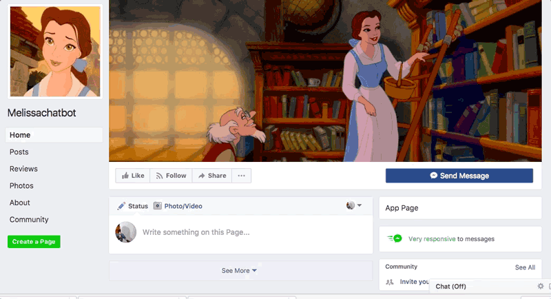

# Build A Bot Workshop

In this workshop we'll build a Facebook chatbot using code. Along the way we'll learn the basics of building an application, the Javascript programming language, and Node.js, which is a way to use Javascript to build applications. The best part is this course requires no experience. You don't need *any* experience at all in code, you don't even have to know what Javascript is. But along the way you'll learn and hopefully build lots of your own bots in the future. 

## All you need is

* A computer :computer:, any computer is fine. We're serious. 
* A Facebook account
* A free [Glitch.com](https://glitch.com) account
* some colored index cards
* [You may want to print out or save the workshop checklist and blank worksheets to help you follow along](appendix.md)
* :sparkles: Creativity :rainbow:

## Contents

* [Design Your Bot](bot-design.md)
* [Create Your Bot App](create-app.md)
* [Code Your Bot](write-code.md)
* [Teach Your Bot Cool Tricks](bot-tricks.md)
* [Next Steps](next-steps.md)

This workshop was created for ChickTech Chicago High School 2017
