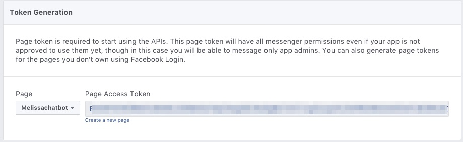
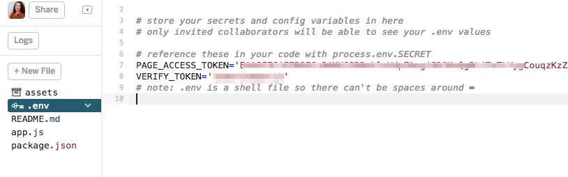
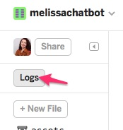
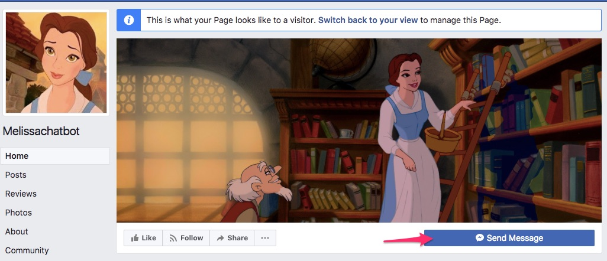
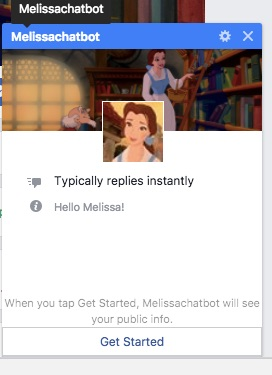
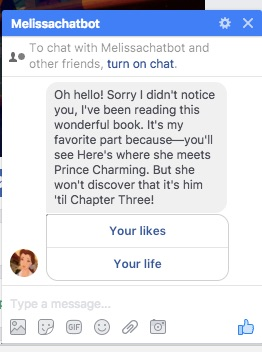
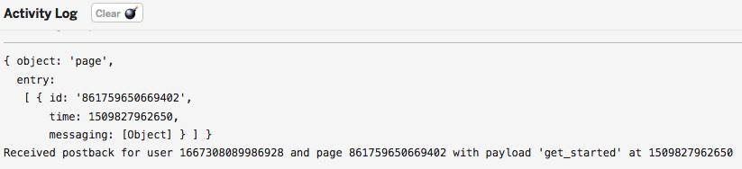

# Build A Bot Workshop


In this workshop we'll build a Facebook chatbot in 5 easy steps. Along the way we'll learn the basics of building an application, the Javascript programming language, and Node.js which is a way to use Javascript to build applications.

## Step 1: Create your app

### What is an app?
App is short for application, it's just a computer program that can perform functions, activities, or tasks. Every application needs a home, and since our application needs to talk to Facebook, which lives on the internet, it will need to live on the internet too. A home that allows an application to talk to the internet is called a "server." In the olden days, a server was a physical object, but nowadays they often are "virtual" which means hundreds or thousands of virtual servers are in one giant physical server. So it's more like a condo than a house.

A great place for an app to live is Glitch, which uses containers to further subdivided a virtual server-  it's more like having a room in a shared apartment. You share the kitchen, which is like the operating system, but have your own bedroom which is like your own application. It's free and more importantly it's easy and you can edit the application as long as you connected to the internet. Also Glitch has a lot of basic apps you can just copy by "remixing them."

### What is Javascript?
Our app will be built using Javascript. Javascript is probably the most famous of all computer languages. A computer language is simply a way for us to tell computers what to do. Javascript is critical to the internet because it's the language your browser understands. HTML and CSS are the structure and appearance, but JS makes the web interactive. Want to play a video? See the latest FB updates automatically without refreshing your browser? Chat with your friends? Play a game on the web? [JS makes that possible.](https://medium.freecodecamp.org/what-the-web-looks-like-without-javascript-c7eaf09c9983) 


But JS can also be used for so much more. 

### What is Node.js?
Our application won't interact directly with the browser at all. It will interact with Facebook, which has something called an API. API stands for Application programming interface, here it's just a set of things we can tell FB messenger to do. This collection of instructions will make up our Bot. 

We're using Node.js to do that, which runs Javascript on a server framework. You can install more functionality for any Node.js application pretty easily using **packages**, which are like more applications you can install into your own application. They can do things like process code and help you debug your application.

### What are Chatbots?

Chatbots are just apps you can "chat" with. They've existed a long time. A human can send one a message and get a reply. You can reply with another message, a picture, a song, a video ... pretty much anything you can think of. They can exist anywhere can people send messages. Early chatbots chatted with people on Aol Instant Messenger and IRC, which were popular in the 2000s. These days Chatbots are popular on Facebook, Slack, and Amazon's Alexa.

## Step 2: Design Your Bot

### Write Your Script
Right now we'll be thinking about what kind of bot you want to build. And we'll start an exercise that will help us design it. Designing is one of the most important part of the process. I've provided a kit for helping us write our chatbots. Messages have a 640 character limit and questions should be about 20 characters, so be aware of that when writing your script.

There are few options in the sample project for your scripts. Let's start with a bot based on a character (fictional or real...including yourself). If we have time we can also create a quiz or a story.

#### A Basic Character Script
With an example!

**What character will your bot have? Get creative: you can use an existing character, a new one you make up or even yourself!**

Belle Bot - a bot based the character from Beauty & The Beast

**What things would you your character to tell people talking to them?**

* I yearn for adventure
* I love to read
* I live in a small French village
* I have a horse named Philippe
* I have a father, Maurice, who is an inventor
* I do not like Gaston

**What kind of questions would someone ask your character in order to get them to say those things?**

* What are your dreams?  I yearn for adventure
* What do you like to do? I love to read
* Where do you live? I live in a small French village
* Do you have any pets? I have a horse named Philippe
* What's your family like? I have a father, Maurice, who is an inventor
* What do you dislike? I do not like Gaston

**Now we need to give your conversation a flow - can you divide your questions up into some categories with about 2-3 questions per category?**

* likes
  * What are your dreams?  I yearn for adventure
  * What do you like to do? I love to read
  * What do you dislike? I do not like Gaston
* life
  * Where do you live? I live in a small French village
  * What's your family like? I have a father, Maurice, who is an inventor
  
  
 **Now let's turn those categories into questions themselves. How might someone ask about this aspect of your character?**
 
 * likes = what do you like to do?
 * life = tell me more about you
 
**Give your bot some personality! Write your answers in your characters voice. Don&#39;t forget a greeting and goodbye !**

* Oh hello! Sorry I didn't notice you, I've been reading this wonderful book. It's my favorite part because—you'll see
Here's where she meets Prince Charming But she won't discover that it's him 'til Chapter Three! 
* What do you like to do?
  * In this little village there isn't much, Père Robert's bookstore is just about my favorite place to go. 
    * What book were you reading?
     * Romeo & Juliet. It's about two lovers in fair Verona. 
    * Where do you want to go?
     * I am not sure, but I know I want adventure in the great wide somewhere. I want it more than I can tell. 
    * What's your least favorite part about the town?
     * Well there is this name named Gaston. Boorish, brainless. He thinks I would want to be his wife. Can you imagine?
* Tell me more about you
  * I was just about to go for a walk in town, get a new book to read. There is nothing more I like to do here. 
    * The town?
     * Yes, it's not much. A quite village, eery day like the one before. Little town, full of little people. I want much more than this provincial life!
    * How's your family?
     * Oh it's just me and my father, Maurice, he's an inventor. He wants to give up, he's had so much trouble getting his new contraption to work. But I believe in him! We also have a horse, Philippe.
* Well thanks for talking to me, I'm off now, need to put my books in the basket and get to town. I hope Gaston isn't there! Last time I saw him he took my book and threw it into a puddle.

#### :tada: **Activity** :tada:

Let's put our story on notecards so we can organize it. Each answer should be on a *red* notecard, and each question should be a on *green* notecard. Arrange your notecards to show the pathway of how our chatbot can answer. 

## Step 3: Create Your First App!
### Glitch.com
Our app already contains the instructions that Node uses to connect to FB. It sends FB specially formatted data and also listens for FB to send data back. But we need to connect it correctly so FB will trust it. We also need to give the application its own page - the page is what people who want to message our bot will message.

Any app already existing on Glitch can be copied using the "remix" function. Head over to the base project [I created](https://melissachatbot.glitch.me/).


Sweet, now you have your own app just like the one I made. We'll go over the files in more detail later but here's some info about each:

* Assets is a folder where you can put images and other media if you want to use it in your project
* .env has secret info your app will use like passwords
* README.md contains technical info about the project
* actions.js contains code for actions your app performs like sending and receiving messages
* api.js contains integrations for the Facebook API
* app.js starts our server
* messages.js is the code containing the text and formatting of messages our app sends
* package.json tells Node.js what packages the app uses. If you remember packages from earlier, they are like other applications that can extend the functionality of ours. The ones the base project includes are:
 * Express, which is a framework for created a simple server
 * Body-parser, which helps our application understand incoming data from Facebook
 * Request, a tool for sending data to Facebook
* server.js is the code for our server
* welcome.html is our project's webpage


### Become An Official FB Developer
Becoming an official Facebook Developer is easy, you don't have to do much special, just go to [developers.facebook.com/apps](https://developers.facebook.com/apps) and accept the terms & conditions.

After that we can create our first Facebook app. Name it after your bot and add your email.


Awesome! Your Facebook app is created, now we'll add Messenger to your app since you'll be able to talk to your bot through Messnger. Just head to "Add Product" on the sidebar and click "Set Up" under Messenger


### Create a FB Page For Your App

When you message your chatbot you'll be messenging a Facebook Page. So we'll need to create a Facebook page. Head over to this link: [facebook.com/pages/create/](https://www.facebook.com/pages/create/). Select "brand or product" and then "app."


#### :tada: **Activity** :tada:
Decorate your Facebook page by adding a profile image, cover image, changing the description, and playing around with other settings. 


### Connect Your App To FB
Ok so now we have a Facebook app and a Glitch app. They'll need to talk to each other for our bot to work. So let's connect them!

So Facebook wants to make sure it's you on Glitch and not some terrible hacker or something. So we'll need what's essentially two passwords. One is the Page Access Token, which gives it permission to use your page, the other is Verify Token, which the Glitch app belongs to you. You'll stick both into Glitch in a special file called .env. That file is private, so even if you share your app, people won't be able to view it. One thing to know about it is do not put spaces in it, or it won't work.

The Page Access Token is generated by facebook, head to the Messenger section of your app and select your page to get one. 



Great, now let's head to Glitch and copy it in



OK now it's time to create a verify token. It can be anything, but it's a password so chose something good. I've given an example here which is not my app's password, but this is not something you should share otherwise. Put it in your that same .env file. Now we'll head back to the facebook page and tell it about our Glitch app, using something called a Webhook. A web hook is essentially the connection between your Glitch app and your Facebook app, allowing them to send messages back and forth. On your app in the Messenger section, scroll down to find the "Webhooks" section. Click "Setup Webhooks."


you'll see the following form. Enter you Glitch app URL with "/webhook" at the end and your Verify Token


If you're successful you should get a nice green checkmark. And now finally you'll subscribe so it knows what page to use to send and receive messages.


Back on Glitch we should check out something called the "Logs," it's where our app writes behind the scenes messages about what's going on. 



If our app is working properly you should see a message indicting that the server is running.


### Test Our Chatbot
In order to message our chatbot, we'll need to go to our page and switch to "View As Page Visitor." You'll find that under the "..." menu.


Now we should see an active "Send Message" button and can click on it



If it's successful we should see a profile picture with some info and a "get started button"



Clicking that should trigger our first message, which should be from the example. We'll change it to yours soon.



In the meantime let's check out our logs. In our logs you can see what the server sent to our app when we clicked "get started"




## Step 4: Write Your Story With Code

### Learn about Javascript Data Types
Javascript can understand many different types of data, but you often need to tell it what kind of data you're using. For example you can tell Javascript to do 4 + 4. Javascript can do math so you'd expect 8 right? But if you wrap the "4+4" in quotes Javascript will instead return "4+4". If you wrap the fours themselves in strings like "4" + "4" Javascript will return "44". That's because the quotes tell Javascript your four is a "string", which is like a word, rather than a number. Yeah, you'd understand if I asked you "4+4" but Javascript is just a computer language, so it sometimes doesn't understand. 

The reason this is important for our bots is that we need to send Facebook messages that it understands. Our writing can be seen as data as well. It needs to be the right type and also formatted correctly. The data types we'll be using are: objects, arrays, and strings mainly.

We already learned about strings, but what about objects? You can think of objects as just a categorized list. For example you could make an object to organize a phone book. What kind of data would you put in a phone book? Can you think of an example entry?

So like 
> First name: Melissa

> Last name: McEwen

> Phone number : 555-555-555

To turn that into something JS will understand, let's create an object. 

First we want to declare a variable, the variable stores our data. So we can just use the variable in other things rather than writing the data over and over again. You can store any data type in a variable. And you can name it most anything, except you cannot use spaces and certain other characters in JS. 

So I'll just name it Melissa. And to start an object all if have to do is use some "curly braces". 
```javascript
var melissa = {}

```

OK inside those curly braces I'll put my data. Each piece of data has a "key" which tells me what the data is for. Like what kind of data is "McEwen"?

I can use any word I want for this- last name, surname but it is also a variable, it's just like a variable inside the melissa variable, so I'll need to write it as a variable. Then I use a colon and then I the data that is stored - so in this case "McEwen." This is a piece of data and I'm going to use the string type since it's a word. I might also want to use that type for "555-555-5555" because otherwise JS will think it's 555 minus 555 minus 5555 and I want it to just leave it alone and not do math on it :) 
```javascript
phone : "555-555-5555",
firstname: "melissa"
lastname : "mcewen"

```
Now I'll stick all that stuff into my Melissa variable

```javascript
var melissa = {
 phone : "555-555-5555",
 firstname: "melissa",
 lastname : "mcewen",
}

```
Tada! Now you have an object!

We'll also use arrays. Arrays are like lists and they can also contain any data, but they do not have keys like objects do. Think of your favorite foods. We'll turn them into an array.

Arrays use brackets like this and we'll also put our new array in a variable
```javascript
var favFoods = []

```

Now we'll add a bunch of foods in there, as many as we want, the only rule is we separate them by a comma. What kind of data should we format our foods as?

If you said strings you're right!
```javascript
var favFoods = ["pizza", "hot dogs", "lettuce"]

```

These lists can also go inside our object


```javascript
var melissa = {
 phone : "555-555-5555",
 firstname: "melissa",
 lastname : "mcewen",
 favFoods : ["pizza", "hot dogs", "lettuce"]
}

```
### Learn About Documentation

Most APIs have something called documentation, which tell you the correct way to use them. You can find Facebook Messenger's [here](https://developers.facebook.com/docs/messenger-platform/). I'll tell you a bit about how to use it, but feel free to browse around. 

For now let's take a look at [Button Template](https://developers.facebook.com/docs/messenger-platform/send-messages/template/button). The Button Template is one of several different message templates available for Facebook chatbot messages. You saw it used in our test messages. If you scroll down you'll see what you need to send to the API to create one. Take a look at it. While it might look a bit complicated, it's made up of what we just saw before. What data types do you see?


:tada: **Activity** :tada:
Discuss what the three highlighted parts might mean and what data structures they contain. Now look at the following example then see if you can see what parts of the example message might go with each part.


### Learn About Functions
In the previous activity you figured out how a message was formatted with data structures. But you also looked at our first function. A function takes arguments, a type of input, and does things with this. In this case, it took a variable called recipientId as an argument, and took the message and sent it to that recipient. A function can have any name similar to the names allowed for variables.

What a function is called it looks like this:
```javascript
functionName(argument)
```
The function we looked at called another functon 

```javascript
  API.callSendAPI(messageData);
```
Head over to api.js in your Glitch app and take a look at that function. What does it take as an input? What do you think it does?

We also saw that the buttons were an array, that contained a reference to something called a "postback." A postback is just what the button should do when it is pressed. Let's head to actions.js and look at a function there called receivedPostback. What do you think this does?

Now in this function you're going to see something very important in Javascript. That's the if statement. It looks like this

```javascript
  if (payload === "get_started"){
      Messages.sendGreeting(senderID);
  }
```

Basically what it is doing is saying if the button pressed had the action "get_started" then we do the function in the curly braces {}. What if it's not? Well look at the next if statement. What's that looking for? What do you think we need to do to make all our actions work? 

#### :tada: **Activity** :tada:
Think of variable names for your questions that describe them but are valid Javascript variable names, put them on *yellow* notecards next to their corresponding question (the *green* cards). 

Think of function names for all your responses, put them on *blue* notecards next to their corresponding responses. 


### Add The Actions To Your Postback Functions
Now we'll use those yellow notecards to write some code. 

### Write The Functions For Your Responses

```javascript
```


