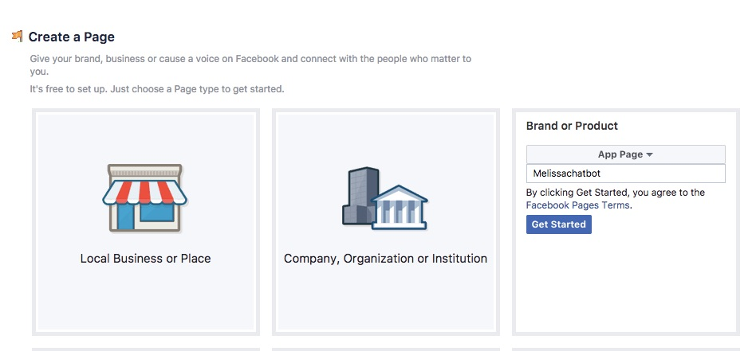
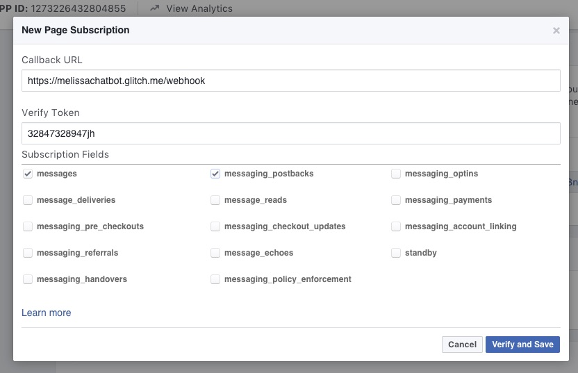

# Build A Bot Workshop

In this workshop we'll build a Facebook chatbot in 5 easy steps. Along the way we'll learn the basics of building an application, the Javascript programming language, and Node.js which is a way to use Javascript to build applications.

## Step 1: Create your app

### What is an app?
App is short for application, it's just a computer program that can perform functions, activities, or tasks. Every application needs a home, and since our application needs to talk to Facebook, which lives on the internet, it will need to live on the internet too. A home that allows an application to talk to the internet is called a "server." In the olden days, a server was a physical object, but nowadays they often are "virtual" which means hundreds or thousands of virtual servers are in one giant physical server. So it's more like a condo than a house.

A great place for an app to live is Glitch, which uses containers to further subdivided a virtual server-  it's more like having a room in a shared apartment. You share the kitchen, which is like the operating system, but have your own bedroom which is like your own application. It's free and more importantly it's easy and you can edit the application as long as you connected to the internet. Also Glitch has a lot of basic apps you can just copy by "remixing them."

### What is Javascript?
Our app will be built using Javascript. Javascript is probably the most famous of all computer languages. A computer language is simply a way for us to tell computers what to do. Javascript is critical to the internet because it's the language your browser understands. HTML and CSS are the structure and appearance, but JS makes the web interactive. Want to play a video? See the latest FB updates automatically without refreshing your browser? Chat with your friends? Play a game on the web? [JS makes that possible.](https://medium.freecodecamp.org/what-the-web-looks-like-without-javascript-c7eaf09c9983) 

But JS can also be used for so much more. 

### What is Node.js?
Our application won't interact directly with the browser at all. It will interact with Facebook, which has something called an API. API stands for Application programming interface, here it's just a set of things we can tell FB messenger to do. This collection of instructions will make up our Bot. 

### What are Chatbots?

## Step 2: Create Your First App!
### Glitch.com
Our app already contains the instructions that Node uses to connect to FB. It sends FB specially formatted data and also listens for FB to send data back. But we need to connect it correctly so FB will trust it. We also need to give the application its own page - the page is what people who want to message our bot will message.

### Become an official FB developer
https://developers.facebook.com/apps

### Create a FB Page For Your App

### Connect Your App To FB

### Test our bot using the console

### Troubleshooting

## Step 3: Design Your Bot

### Write Your Script
Right now we'll be thinking about what kind of bot you want to build. And we'll start an exercise that will help us design it. Designing is one of the most important part of the process. I've provided three kits for helping us write our chatbots. Messages have a 640 character limit and questions should be about 20 characters, so be aware of that when writing your script.

There are few options in the sample project for your scripts. You can create a bot based on a character (fictional or real...including yourself), a quiz, and a story.

#### A Basic Character Script
With an example!

**What character will your bot have? Get creative: you can use an existing character, a new one you make up or even yourself!**
Belle Bot - a bot based the character from Beauty & The Beast

**What things would you your character to tell people talking to them?**

* I yearn for adventure
* I love to read
* I live in a small French village
* I have a horse named Philippe
* I have a father, Maurice, who is an inventor
* I do not like Gaston

** what kind of questions would someone ask your character in order to get them to say those things? **

* What are your dreams?  I yearn for adventure
* What do you like to do? I love to read
* Where do you live? I live in a small French village
* Do you have any pets? I have a horse named Philippe
* What's your family like? I have a father, Maurice, who is an inventor
* What do you dislike? I do not like Gaston

**Now we need to give your conversation a flow - can you divide your questions up into some categories with about 2-3 questions per category? **

* likes
  * What are your dreams?  I yearn for adventure
  * What do you like to do? I love to read
  * What do you dislike? I do not like Gaston
* life
  * Where do you live? I live in a small French village
  * What's your family like? I have a father, Maurice, who is an inventor
  
  
 **Now let's turn those categories into questions themselves. How might someone ask about this aspect of your character?**
 
 * likes = what do you like to do?
 * life = tell me more about you
 
 
 
 
 
**Give your bot some personality! Write your answers in your characters voice. Don&#39;t forget a greeting and goodbye !**

* Oh hello! Sorry I didn't notice you, I've been reading this wonderful book. It's my favorite part because—you'll see
Here's where she meets Prince Charming But she won't discover that it's him 'til Chapter Three! 
* What do you like to do?
  * In this little village there isn't much, Père Robert's bookstore is just about my favorite place to go. 
    * What book were you reading?
     * Romeo & Juliet. It's about two lovers in fair Verona. 
    * Where do you want to go?
     * I am not sure, but I know I want adventure in the great wide somewhere. I want it more than I can tell. 
    * What's your least favorite part about the town?
     * Well there is this name named Gaston. Boorish, brainless. He thinks I would want to be his wife. Can you imagine?
* Tell me more about you
  * I was just about to go for a walk in town, get a new book to read. There is nothing more I like to do here. 
    * The town?
     * Yes, it's not much. A quite village, eery day like the one before. Little town, full of little people. I want much more than this provincial life!
    * How's your family?
     * Oh it's just me and my father, Maurice, he's an inventor. He wants to give up, he's had so much trouble getting his new contraption to work. But I believe in him! We also have a horse, Philippe.
* Well thanks for talking to me, I'm off now, need to put my books in the basket and get to town. I hope Gaston isn't there! Last time I saw him he took my book and threw it into a puddle.

testing 123

