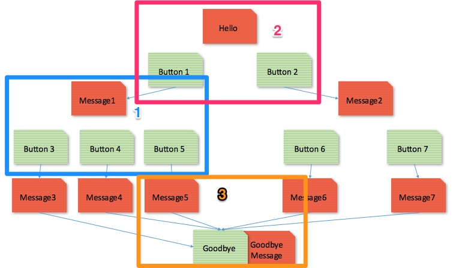
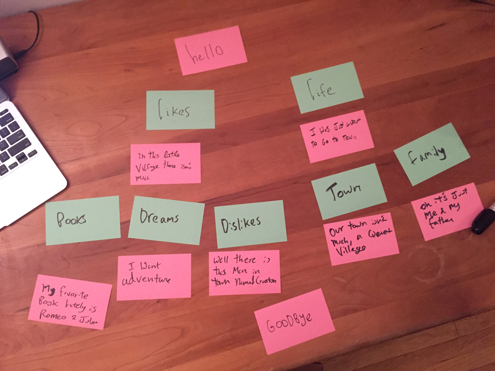

# Design Your Bot

## What are Chatbots?

Chatbots are just apps you can "chat" with. They've existed a long time. A human can send one a message and get a reply. You can reply with another message, a picture, a song, a video ... pretty much anything you can think of. They can exist anywhere can people send messages. Early chatbots chatted with people on Aol Instant Messenger and IRC, which were popular in the 2000s. These days Chatbots are popular on Facebook, Slack, and Amazon's Alexa.

## Example chatbots
* [estherbot - a bot resume](http://www.estherbot.com/)
* [poncho - a weather bot](https://www.messenger.com/t/hiponcho)
* [mojihunt- an emoji game](https://www.messenger.com/t/mojihunt)
* [whole foods-recipe bot](https://www.messenger.com/t/WholeFoods)
* [sequel stories - a story bot](https://www.facebook.com/storiesonsequel/)

### :tada: **Activity** :tada:
Message some of the example chatbots

## Write Your Script
Right now we'll be thinking about what kind of bot you want to build. And we'll start an exercise that will help us design it. Designing is one of the most important part of the process. I've provided a kit for helping us write our chatbots. Messages have a 640 character limit and questions should be about 20 characters, so be aware of that when writing your script.

There are few options in the sample project for your scripts. Let's start with a bot based on a character (fictional or real...including yourself). If we have time we can also create a quiz or a story.

### A Basic Character Script
With an example!

**What character will your bot have? Get creative: you can use an existing character, a new one you make up or even yourself!**

Belle Bot - a bot based the character from Beauty & The Beast

**What things would you have your character to tell people talking to them?**

* I yearn for adventure
* I love to read
* I live in a small French village
* I have a horse named Philippe
* I have a father, Maurice, who is an inventor
* I do not like Gaston

**What kind of questions would someone ask your character in order to get them to say those things?**

* What are your dreams?  I yearn for adventure
* What do you like to do? I love to read
* Where do you live? I live in a small French village
* Do you have any pets? I have a horse named Philippe
* What's your family like? I have a father, Maurice, who is an inventor
* What do you dislike? I do not like Gaston

**Now we need to give your conversation a flow - can you divide your questions up into some categories with about 2-3 questions per category?**

* likes
  * What are your dreams?  I yearn for adventure
  * What do you like to do? I love to read
  * What do you dislike? I do not like Gaston
* life
  * Where do you live? I live in a small French village
  * What's your family like? I have a father, Maurice, who is an inventor
  
  
 **Now let's turn those categories into questions themselves. How might someone ask about this aspect of your character?**
 
 * likes = what do you like to do?
 * life = tell me more about you
 
**Give your bot some personality! Write your answers in your characters voice. Don&#39;t forget a greeting and goodbye !**

* Oh hello! Sorry I didn't notice you, I've been reading this wonderful book. It's my favorite part because—you'll see Here's where she meets Prince Charming. But she won't discover that it's him 'til Chapter Three. Would you like to know about the things I like? Or maybe about my life?
* Your likes
  * In this little village there isn't much, Père Robert's bookstore is just about my favorite place to go. Do you want to know about my favorite books? My dreams? Or maybe what I dislike?
    * fav books
      * My favorite book lately is Romeo & Juliet. It's about two lovers in fair Verona. 
    * dreams
      *  am not sure exactly about all my dreams, but I know I want adventure in the great wide somewhere. I want it more than I can tell.
    * dislikes
      * Well there is this man in town named Gaston. Boorish, brainless. He thinks I would want to be his wife. Can you imagine?
* Your life
  * I was just about to go for a walk in town, get a new book to read. I love reading. The library makes our small corner of the world feel big. Would you like to know more about the town? Or about my family?
    * The town
      * Our town isn't much. A quiet village, every day like the one before. Little town, full of little people. I want much more than this provincial life!
    * Your family
      * Oh it's just me and my father, Maurice, he's an inventor. He wants to give up, he's had so much trouble getting his new contraption to work. But I believe in him! We also have a horse, Philippe.
* Well thanks for talking to me, I'm off now, need to put my books in the basket and get to town. I hope Gaston isn't there! Last time I saw him he took my book and threw it into a puddle.

## Visualize Your Flow
Let's put our story on notecards so we can organize it. 
* Each answer should be on a *red-ish pink* :heart: notecard
* Each question should be a on :green_heart: *green* notecard. 

Arrange your notecards to show the pathway of how our chatbot can answer. 

### :tada: **Activity** :tada: Card Layout Example
But first see how much you know about chatbot design with this quiz.

Match the parts of the story from the example to the flow
| A. * Oh hello! Sorry I didn't notice you, I've been reading this wonderful book. It's my favorite part because—you'll see Here's where she meets Prince Charming. But she won't discover that it's him 'til Chapter Three. Would you like to know about the things I like? Or maybe about my life?      * Your likes    * About you |
|-------------------------------------------------------------------------------------------------------------------------------------------------------------------------------------------------------------------------------------------------------------------------------------------------------------------------------------|
|                                                                                                                                                                                                                                                                                                                                     |
|                                                                                                                                                                                                                                                                                                                                     |
|                                                                                                                                                                                                                                                                                                                                     |

### :tada: **Activity** :tada:

