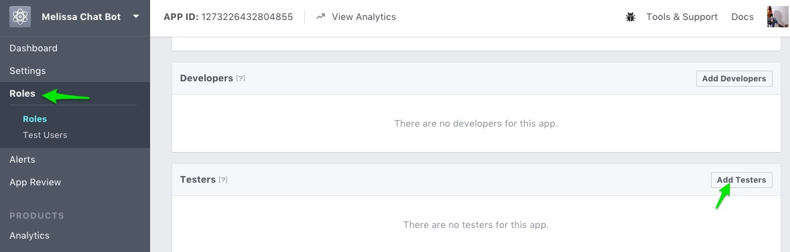
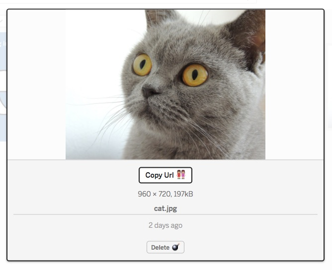
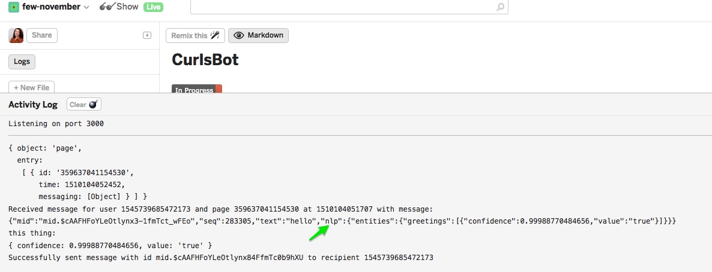

# Add More Functionality To Your Chatbot

## Add your friends as testers
So right now your bot will only work for you. If anyone else messages your page, they will not receive messages from the bot. You can add your friends or family as testers though and then the bot should respond to them. To do this go to your app page on developers.facebook.com and click "roles". Then click "add testers."


If you'd like to get your app officially released and accessible for everyone, [you'll need to go through the approval process, which is beyond the scope of this class, but you can email me for help](https://developers.facebook.com/docs/messenger-platform/app-review/).

## Send pictures
The receivedMessage function in action.js also sends a picture in response to one message. It uses the sendImage function, which takes the sender id and the picture url as arguments. You can use that function too and it's easy. Click on the assets directory in your Glitch app.


you can just drag images here, and then click the image to get the URL



Then you can use the url as the argument in the function. 


## Respond to text messages
We learned a little bit about how the text messages worked when we learned Javascript conditionals. Right now the bot has a bit of functionality in this area. But what if you want to add your own custom responses? We'll need to modify the receivedMessage function in action.js. 

What do you think includes() means? Does it work for all the text you'd like your bot to respond to?


## Other types of buttons
When we worked with the receivedPostback function, our responses had buttons. The buttons when pressed triggered a new postback. But that's not the only kind of button available in the API. Check out the [Buttons](https://developers.facebook.com/docs/messenger-platform/send-messages/buttons) documentation. What kind of other buttons are available?

## Understand various types of greetings and also learn to debug!
How do you greet someone? Do you say "hi" or "hello?" or something else? We learned how to respond to text messsages, but what if you wanted to always respond to a greeting? It might be hard to program in all the types of greetings. Luckily Facebook Messenger integrates with Wit.ai which does NLP(natural language processing). On a very basic level, they fed the AI MANY sentences and told them which words were greetings so now Wit.ai can predict whether or not something is. 

Let's turn it on in our developers.facebook.com app page. Go to your Messenger section and scroll down to Built-In NLP, then select your page. Toggle the switch to on.


But how do we get our bot to respond appropriately? Send your bot a message saying hi. 

Now head to your logs and check them out. We have a new object called nlp


Notice it says "greetings" and a "confidence" - the confidence is how sure it is this is actually a greeting. And it's 99% that "hi" is a greeting here. 

Now we need to grab that data and use it. Create a new var like this in your receivedMessage function
```javascript
  var greeting = firstEntity(message.nlp, 'greetings');
  
  
```

firstEntity is a wit.ai helper method that will grab the data we need from that object we just viewed. 

under that let's console.log our greeting and send a hello message to our bot again.

```javascript
  console.log(greeting)
```

Finally we know what the greeting looks like and what it contains, let's add our conditional, which will run only if there is a greeting and if the greeting confidence is over 80%.

```javascript
  if (greeting && greeting.confidence > 0.8) {
    sendTextMessage(senderID, "Well hello there! ");
  }
```
## Using emoji in our responses


## Create more cool stuff with chatbots
In the appendix there are further examples of what you can do with chatbots including a quiz. Also further resources for learning more node.js and Javascript. 
