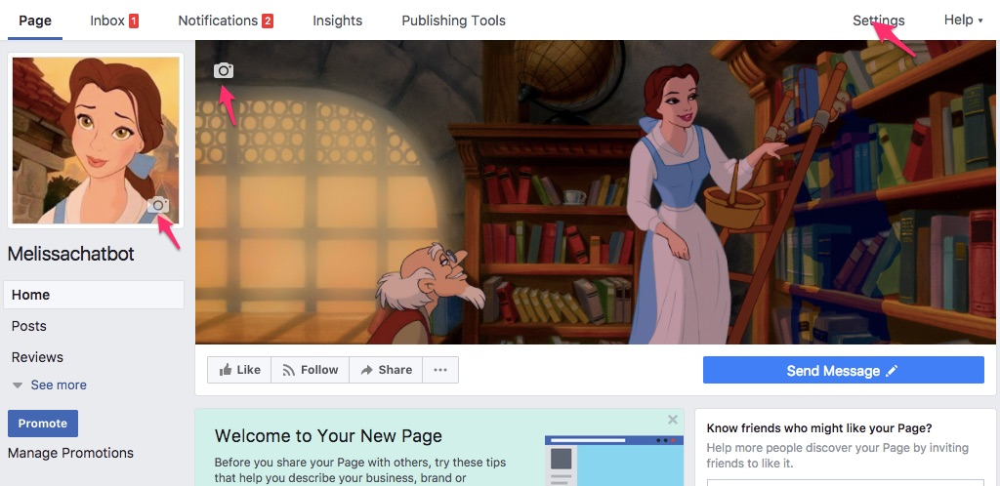

# Create Your First App!

## What is Javascript?
Our app will be built using Javascript. Javascript is probably the most famous of all computer languages. A computer language is simply a way for us to tell computers what to do. Javascript is critical to the internet because it's the language your browser understands. HTML and CSS are the structure and appearance, but JS makes the web interactive. Want to play a video? See the latest FB updates automatically without refreshing your browser? Chat with your friends? Play a game on the web? [JS makes that possible.](https://medium.freecodecamp.org/what-the-web-looks-like-without-javascript-c7eaf09c9983) 

But JS can also be used for so much more. 

## What is Node.js?
Our application won't interact directly with the browser at all. It will interact with Facebook, which has something called an API. API stands for Application programming interface, here it's just a set of things we can tell FB messenger to do. This collection of instructions will make up our Bot. 

We're using Node.js to do that, which runs Javascript on a server framework. You can install more functionality for any Node.js application pretty easily using **packages**, which are like more applications you can install into your own application. They can do things like process code and help you debug your application.

## What is an app?
App is short for application, it's just a computer program that can perform functions, activities, or tasks. Every application needs a home, and since our application needs to talk to Facebook, which lives on the internet, it will need to live on the internet too. A home that allows an application to talk to the internet is called a "server." In the olden days, a server was a physical object, but nowadays they often are "virtual" which means hundreds or thousands of virtual servers are in one giant physical server. So it's more like a condo than a house.

A great place for an app to live is Glitch, which uses containers to further subdivided a virtual server-  it's more like having a room in a shared apartment. You share the kitchen, which is like the operating system, but have your own bedroom which is like your own application. It's free and more importantly it's easy and you can edit the application as long as you connected to the internet. Also Glitch has a lot of basic apps you can just copy by "remixing them."

## Glitch.com
Our app already contains the instructions that Node uses to connect to FB. It sends FB specially formatted data and also listens for FB to send data back. But we need to connect it correctly so FB will trust it. We also need to give the application its own page - the page is what people who want to message our bot will message.

Any app already existing on Glitch can be copied using the "remix" function. Head over to the base project [I created](https://melissachatbot.glitch.me/).

Sweet, now you have your own app just like the one I made. We'll go over the files in more detail later but here's some info about each:

* Assets is a folder where you can put images and other media if you want to use it in your project
* .env has secret info your app will use like passwords
* README.md contains technical info about the project
* actions.js contains code for actions your app performs like sending and receiving messages
* api.js contains integrations for the Facebook API
* app.js starts our server
* messages.js is the code containing the text and formatting of messages our app sends
* package.json tells Node.js what packages the app uses. If you remember packages from earlier, they are like other applications that can extend the functionality of ours. The ones the base project includes are:
 * Express, which is a framework for created a simple server
 * Body-parser, which helps our application understand incoming data from Facebook
 * Request, a tool for sending data to Facebook
* server.js is the code for our server
* welcome.html is our project's webpage

Some other things to know is Glitch is a live code editor, which means every time you make changes, your app will be updated.

Also, all code has lines numbers. Sometimes we'll refer to the line numbers when looking at code. 

If you make any changes you end up not liking and want to go back to the original, you can find it here [here at my Github repo](https://github.com/melissamcewen/melissachatbot).

What is Github? It's just a place to store code and share it with other people using a revision control system called Git. Revision control allows you to see when things were changed, how they were changed, and who they were changed by. This makes it easy to go back to a previous version. 

### Become An Official FB Developer
Becoming an official Facebook Developer is easy, you don't have to do much special, just go to [developers.facebook.com/apps](https://developers.facebook.com/apps) and accept the terms & conditions.

After that we can create our first Facebook app. Name it after your bot and add your email.

Awesome! Your Facebook app is created, now we'll add Messenger to your app since you'll be able to talk to your bot through Messnger. Just head to "Add Product" on the sidebar and click "Set Up" under Messenger

### Create a FB Page For Your App

When you message your chatbot you'll be messenging a Facebook Page. So we'll need to create a Facebook page. Head over to this link: [facebook.com/pages/create/](https://www.facebook.com/pages/create/). Select "brand or product" and then "app."

### :tada: **Activity** :tada:
Decorate your Facebook page by adding a profile image, cover image, changing the description, and playing around with other settings. 

## Connect Your App To FB
Ok so now we have a Facebook app and a Glitch app. They'll need to talk to each other for our bot to work. So let's connect them!

So Facebook wants to make sure it's you on Glitch and not some terrible hacker or something. So we'll need what's essentially two passwords. One is the Page Access Token, which gives it permission to use your page, the other is Verify Token, which the Glitch app belongs to you. You'll stick both into Glitch in a special file called .env. That file is private, so even if you share your app, people won't be able to view it. One thing to know about it is do not put spaces in it, or it won't work.

The Page Access Token is generated by facebook, head to the Messenger section of your app and select your page to get one. 

Great, now let's head to Glitch and copy it in

OK now it's time to create a verify token. It can be anything, but it's a password so chose something good. I've given an example here which is not my app's password, but this is not something you should share otherwise. Put it in your that same .env file. Now we'll head back to the facebook page and tell it about our Glitch app, using something called a Webhook. A web hook is essentially the connection between your Glitch app and your Facebook app, allowing them to send messages back and forth. On your app in the Messenger section, scroll down to find the "Webhooks" section. Click "Setup Webhooks."

you'll see the following form. Enter you Glitch app URL with "/webhook" at the end and your Verify Token

If you're successful you should get a nice green checkmark. And now finally you'll subscribe so it knows what page to use to send and receive messages.

Back on Glitch we should check out something called the "Logs," it's where our app writes behind the scenes messages about what's going on. 

If our app is working properly you should see a message indicting that the server is running.

### Test Our Chatbot
In order to message our chatbot, we'll need to go to our page and switch to "View As Page Visitor." You'll find that under the "..." menu.

Now we should see an active "Send Message" button and can click on it

If it's successful we should see a profile picture with some info and a "get started button"

Clicking that should trigger our first message, which should be from the example. We'll change it to yours soon.

In the meantime let's check out our logs. In our logs you can see what the server sent to our app when we clicked "get started"

