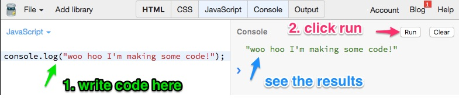
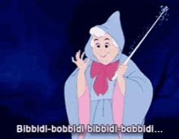
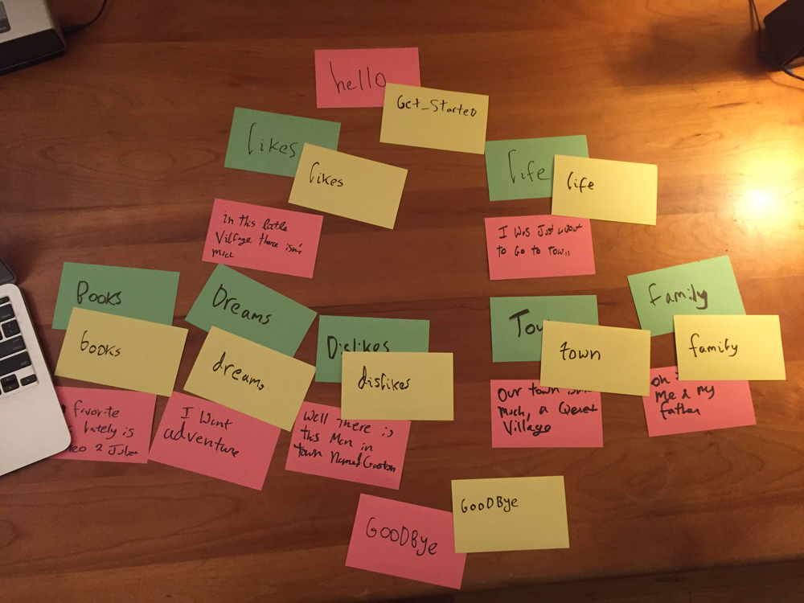

# Write Your Story With Code
## Code Tools
To write some Javascript and test it out, we'll be using a site called jsbin.com.

It's very easy to use. 


There is code on the left side, that's where we will write our Javascript. We can use something called
```javascript
  console.log("anything between these quotes will be shown on the console");
```
to see the results. And the results will show on the **console**, which is the right side.

## Variables
Head to [jsbin and click run](http://jsbin.com/laweped/edit?js,console){:target="_blank"}, then see if you can complete the exercise.


### :tada: **Activity** :tada: My name is a variable
```javascript
//creating a variable is easy!
var myVariable = "my name is ";

// console.log is a way we can see what a variable 
// is in our handle console over there
// click run to see it in action

console.log(myVariable);

// create your own variable with your name. Call it yourVariable


// Now let's try something new - using multiple variables together
// remove the // from the next line and click run
//console.log(myVariable + yourVariable);
```

## Javascript Data Types
OK but there are different types of things we can put inside variables. They are called data types. Let's learn about those with more activities.
### :tada: **Activity** :tada: What Type?

[Click here to go to Jsbin](http://jsbin.com/fixoqe/edit?js,console){:target="_blank"}.
```javascript
// Here is our handy variable again
var myVar = "my name is ";

//now look at this variable
var myNumber = 5;

//what's the difference? Click run to find out

console.log("MyVar is a " + typeof myVar);
console.log("myNumber is a " + typeof myNumber);
```
### :tada: **Activity** :tada: My Favorite Foods

[Click here to go to Jsbin](http://jsbin.com/digidux/edit?js,console){:target="_blank"}

```javascript
// What if we want to store a list of things?
// We're in luck, Javascript has a data type for that
// it's called an array
var favFoods = ["pizza", "pasta"];

// try making your own called myFavFoods and logging it to the console
```

### :tada: **Activity** :tada: Personal Address Book

[Click here to go to Jsbin](http://jsbin.com/dexozi/edit?js,console){:target="_blank"}
```javascript
// What if we have a lot of data about one thing
// like about Melissa?
// well here is a new data type

var Melissa = {
  lastName : "Mcewen",
  firstName: "Melissa",
  favColor: "blue"
};

console.log(Melissa);

// this is an object, click run to see what happens


// what is lastName?
// it is a variable, but inside the object we don't use
// var lastName = "Mcewen"
// we use
// lastName : "McEwen"

//but what if we want to print out just the lastName? 
// And not the entire info about Melissa?
console.log(Melissa.lastName);

// Now try printing out the first name


// Now try making your own object with your info
var You = {
  
}

// and printing out just your last name

```

## Javascript Functions
Functions allow Javascript to perform tasks. Using a function is basically like casting a spell



### :tada: **Activity** :tada: Math Spell

We're going to use a site called JSbin to examine some functions. [Head over there and click run to try it](http://jsbin.com/zeleko/edit?js,console){:target="_blank"}. 

```javascript
//defining a function
function mathSpell(number1, number2){
  console.log(number1+number2);
}
//calling a function
mathSpell(2,2);

```

### :tada: **Activity** :tada: Turn Into A Pumpkin
Head on over to [Jsbin](http://jsbin.com/sotomim/edit?js,console){:target="_blank"} and click "run." Then try it yourself!

```javascript
// here is our function
function mySpell(thing){
  return "You've been turned into a " + thing
}


// now let's run our function
console.log(mySpell("pumpkin"))

// what is thing? Thing is called an argument, it is the function's input
//now try it with your own argument! 
// try making the function turn you into an apple or a dinosaur

```

### :tada: **Activity** :tada: Find the bug
Head back over to [Jsbin and run the code](http://jsbin.com/rolaca/edit?js,console){:target="_blank"}. Did you get the answer you expected? 

Can you fix it?

```javascript
//defining a function
function math(number1, number2){
  console.log(number1+number2);
}
//calling a function
math("2","2");
```

## Documentation

Most APIs have something called documentation, which tell you the correct way to use them. You can find Facebook Messenger's [here](https://developers.facebook.com/docs/messenger-platform/). I'll tell you a bit about how to use it, but feel free to browse around. 

For now let's take a look at [Button Template](https://developers.facebook.com/docs/messenger-platform/send-messages/template/button). The Button Template is one of several different message templates available for Facebook chatbot messages. You saw it used in our test messages. If you scroll down you'll see what you need to send to the API to create one. Take a look at it. While it might look a bit complicated, it's made up of what we just saw before. What data types do you see?

```json
curl -X POST -H "Content-Type: application/json" -d '{
  "recipient":{
    "id":"<PSID>"
  },
  "message":{
    "attachment":{
      "type":"template",
      "payload":{
        "template_type":"button",
        "text":"What do you want to do next?",
        "buttons":[
          {
            "type":"web_url",
            "url":"https://www.messenger.com",
            "title":"Visit Messenger"
          },
          {
            ...
          },
          {...}
        ]
      }
    }
  }
}' "https://graph.facebook.com/v2.6/me/messages?access_token=<PAGE_ACCESS_TOKEN>"
```

:tada: **Activity** :tada: Examine the Documentation
Discuss what the example parts might mean and what data types they contain. See if you can find an example of a:

* String
* Object
* Array


### :tada: **Activity** :tada: Function Practice
Head to [jsbin](http://jsbin.com/zuseqe/edit?js,console){:target="_blank"}. See if you can get the myFunction to run and get you the secret code word. Then see if you can write your own function.

```javascript


// declaring a function
function myFunction(argument) {
  //let's store our answer in a variable
  var answer = (argument * 2) - 42;
  // to combine words we taking strings and using + to put them together
  console.log("look for line " + answer + " in messages.js for the answer");
  
}

// call your function with the number 32 as the argument

// now look in messages.js for the secret code word

// Now let's write your own function to take your first and last name as arguments 
// and log your full name to the console
```


### :tada: **Activity** :tada:
Check out lines 19-53 in your actions.js, see if you can get your chatbot to respond with the 4 secret messages coded in this code. 


## Add Your Story To A Function
Remember the example from the documentation? Well we won't need to write anything like that because we are using a function that will format our message for us. 

Checkout line 55 in your Glitch app to see the function receivedPostback. Head over to messages.js to check out the function it calls - sendButtons. 
### :tada: **Activity** :tada:
What arguments does sendButtons take? What kind of data does receivedPostback use when it calls sendButtons? What would you do if you wanted to add more buttons or change a message?

Try completing the code in [this jsbin](http://jsbin.com/ketuhek/edit?js,console){:target="_blank"} to respond with the following


> "you successfully triggered this"

> "successfully called testSendMessage"

> "your message is" *your message*

> "the buttons are:" *your buttons*

```javascript
function practicePostback(event){
  var senderID = "fakeID123";
  var payload = event.postback.payload;
  // 1. edit this to be triggered when the payload is "testme"
  if(payload === ""){
    console.log("you successfully triggered step 1! woohoo");
 
    var buttons = [
    /* 
    2. now let's make two buttons
    the format for a button is:
     {
       type:"postback",
       payload:"action",
       title:"button text"
      }
    */
    ];
    // 3. add a message
    var messageText = "";
    
    // now call testSendMessage
    testSendMessage(senderID, messageText, buttons)
  } else {
    console.log("oops don't forget to edit the 'if' in step 1");
  }
}

// this is a little like the events that facebook sends your app 
// but only contains the payload from a postback
var practiceEvent = {
  postback: {
     payload: "testme"
   }
}

// this is a test version of the SendMessage function
function testSendMessage(senderID, messageText, buttons) {
  console.log("successfully called testSendMessage");
  if (messageText) {
    console.log("your message is " + messageText);
   } else {
     console.log ("oops looks your message is missing, go to step 3 and add one");
   }
  
  if (buttons && buttons.length) {
      console.log ("the buttons are:");
      buttons.forEach(function(element) {
       console.log(element.title);
      });
  } else {
     console.log ("oops looks like the buttons are missing, go to step 2 and add some");
  }


}

//4.  call practicePostback using the practiceEvent variable

```


### :tada: **Activity** :tada:
Think of action names for your questions that describe them but are simple lowercase words that are easy to code in, put them on *yellow* :yellow_heart: notecards next to their corresponding question (the :green_heart: *green* cards). 


The example actions here are:
* get_started
* goodbye
* life
* dislikes
* town
* family
* books
* dreams
* likes


Now we'll add them to our postback function, so that each time a button corresponding to the yellow cards we just created is pressed, the correct message and following buttons are presented:


```javascript
  // if our payload/action is "get_started", send them a message with the following buttons
  if (payload === "get_started"){
     var messageText= "Oh hello! Sorry I didn't notice you, I've been reading this wonderful book. It's my favorite part because—you'll see Here's where she meets Prince Charming But she won't discover that it's him 'til Chapter Three!";
     var buttons = [
     {
      type:"postback",
      payload:"likes",
      title:"Your likes"
    },
    {
      type:"postback",
      payload: "life",
      title: "Your life"
    }
    
    ];
    Messages.sendButtons(senderID, messageText, buttons);
  }
```

The function should refer to the following green cards below it in the outline, or if there are no more left, to the goodbye message
```javascript
  if (payload === "dislikes"){
    var messageText = "Well there is this man in town named Gaston. Boorish, brainless. He thinks I would want to be his wife. Can you imagine?"
    var buttons = [
    {
      type:"postback",
      payload:"goodbye",
      title:"Goodbye"
    }

    ];
    
    Messages.sendButtons(senderID, messageText, buttons);

  }
  
```

These are already coded into the example app, you can simply change the wording. If you need more of them, you can copy and paste. Once you've finished it's time to test your bot out. Does it work? 


```javascript
```
